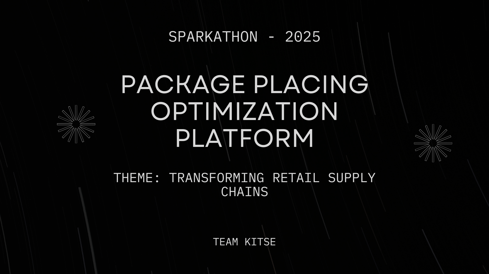

# Package Placing Optimization Platform - Project Submitted for Sparkathon a Walmart hackathon

## Problem Theme

Transforming retail supply chains: From inventory management to last-mile delivery

## Problem Statement

Our project presents a smart logistics solution that streamlines package loading and unloading. By optimizing space, weight distribution, and handling, it enhances operational efficiency and reduces time and effort across the supply chain.

## Demo Video

## What we are solving?

In large-scale retail logistics, inefficiencies in package loading, poor space utilization, and improper handling during transport often lead to delays, increased operational costs, and product damage.

We aim to solve:

- Inefficient packing and space usage in transport containers
- Manual and error-prone loading/unloading processes
- Fragile or priority packages getting mishandled
- Lack of real-time insights into loading status

Our solution ensures smarter container packing based on weight, fragility, and dimensions, reducing damage and optimizing routes, thereby making last-mile delivery faster and more reliable.

## How we are solving?

We developed an intelligent packing and logistics assistant that automates and optimizes the loading, transportation, and unloading process.

Here's how our solution works:

- **Box Optimization Algorithm**: Places packages in containers based on weight, dimensions, fragility, and customer priority, maximizing space utilization.
- **Efficient Loading and Unloading**: Groups packages by delivery priority and fragility to ensure safe and efficient unloading.
- **Visual Interface**: Provides a user-friendly interface for visualizing the packed container and tracking package layers.
- **Automation Ready**: Our system can integrate with warehouse bots or manual systems to streamline operations from warehouse to last-mile delivery.
- **Built with**: Python, FastAPI, React, and MongoDB for robust backend logic, responsive frontend, and real-time data handling.

Our end-to-end solution not only reduces human error but also boosts delivery speed and reduces shipping costs.

## Tech Stack

## Work Flow

## Installation

- Install MongoDB locally on you device: [Official MongoDB Guide](https://www.mongodb.com/docs/manual/installation/)
- Git clone this repo: `git clone https://github.com/h4636oh/walmart-hackathon`
- Change directory: `cd walmart-hackathon`

### Backend

- Change directory: `cd backend`
- Create and enter into virtual enviornment: `python -m venv venv; source ./venv/bin/activate`
- Install dependencies: `pip install -r requirements.txt`
- Run Server: `python main.py`

### Frontend

- Change directory: `cd frontend`
- Install dependencies: `npm i`
- Run development version: `npm run dev`
- Create build version: `npm run build`
- Run build version: `npm run preview`

## Development Repositories

- Frontend Repo: [h4636oh/walmart-hackathon-frontend](https://github.com/h4636oh/walmart-hackathon-frontend)
- Backend Repo: [h4636oh/walmart-hackathon-backend](https://github.com/h4636oh/walmart-hackathon-backend)

## Team

- **[Priyanka More](https://github.com/Mpriynka)**: Backend Developer
- **[Richa Thakwani](https://github.com/ricgir)**: Backend Developer
- **[Deepanshu Choudhary](https://github.com/h4636oh)**: Frontend Developer
